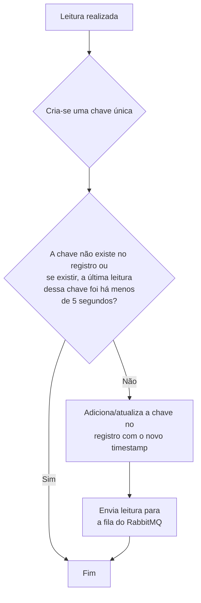

```mermaid
graph TD
    A[Leitura realizada] --> C{Cria-se uma chave única}
    C --> D{A chave não existe no registro ou<br>se existir, a última leitura<br>dessa chave foi há menos<br>de 5 segundos?}
    D -- Não --> E[Adiciona/atualiza a chave no<br>registro com o novo timestamp]
    D -- Sim --> H[Fim]
    E --> G[Envia leitura para<br> a fila do RabbitMQ]
    G --> H[Fim]
```
